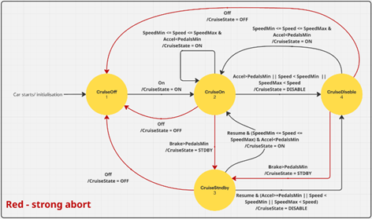

# Cruise Controller

COMPSYS 723 Assignment 2: Implementation of a basic cruise controller in Esterel\
**_Authors: Connor Dunn (cdun954), Lachlan Chan (lcha691)_**

_This project was created for an assignment at The University of Auckland_

## Project Overview

This project implements a simplified cruise control system using the Esterel synchronous programming language.\
It models a reactive system for regulating vehicle speed and is organized into three concurrent modules: a cruise state manager,\
a cruise speed handler, and a throttle controller.

## 1. Cruise State Controller

### Description

The Cruise State Controller manages what state the controller should be in depending on inputs and thresholds below. It will move between four states, depending on which state the cruise controller is in, the outputs of the Throttle Controller and Speed Controller will change how they retrieve their values.

### Inputs

| Type  | Signal | Description                      |
| ----- | ------ | -------------------------------- |
| Pure  | on     | Activates cruise control         |
| Pure  | off    | Deactivates cruise control       |
| Pure  | resume | Reactivates previous cruise mode |
| Float | brake  | Brake pedal sensor               |
| Float | speed  | Current vehicle speed            |
| Float | accel  | Accelerator pedal sensor         |

### Outputs

| Type    | Name        | Description          |
| ------- | ----------- | -------------------- |
| Integer | cruiseState | Cruise Control State |

### Cruise States

- `1`: Off
- `2`: On
- `3`: Standby
- `4`: Disabled

### Thresholds

| Type  | Name      | Value |
| ----- | --------- | ----- |
| Float | PedalsMin | 3.0   |
| Float | SpeedMin  | 30.0  |
| Float | SpeedMax  | 150.0 |

### Transition Logic

 

 

## 2. Cruise Speed Controller

### Description

Cruise Speed Control manages the "Cruise Speed" of the car, based on external inputs and state of the cruise control system. The current speed when the system is first turned on or the cruise speed is set, and can be modified incrementally. The Cruise Speed is kept between two determined thresholds (kmph).

### Thresholds

| Type  | Name     | Value |
| ----- | -------- | ----- |
| Float | speedMin | 30.0  |
| Float | speedMax | 150.0 |
| Float | speedInc | 10.0  |

### Inputs

| Type  | Name         | Description              |
| ----- | ------------ | ------------------------ |
| Pure  | sSet         | Button sets Cruise Speed |
| Pure  | sQuickAccel  | Incrememnts Cruise Speed |
| Pure  | sQuickDecel  | Decrements Cruise Speed  |
| Float | sSpeed       | Current Car Speed        |
| Int   | sCruiseState | Cruise Control State     |

### Outputs

| Type  | Name         | Description                     |
| ----- | ------------ | ------------------------------- |
| Float | sCruiseSpeed | Speed set by the Cruise Control |

### Control Logic

| Input                      | Output                    |
| -------------------------- | ------------------------- |
| Cruise Control is Off      | `CruiseSpeed = 0`         |
| Cruise Control is going on | `CruiseSpeed = Speed`     |
| Cruise Control is set      | `CruiseSpeed = Speed`     |
| Quick Accel applied        | `CruiseSpeed += SpeedInc` |
| Quick Decel applied        | `CruiseSpeed -= SpeedInc` |

 

## 3. Throttle Controller

### Description

The Throttle Controller physically operates the speed of the car, either directly with the accelerator, or with the throttle command given by the implemented cruise regulation functions (PI Controller). The function needs to know whether the Cruise Control system is on, so it can choose how the car is controlled. It also needs to know the state of the accelerator pedal and both, the car's current speed and cruise speed.

### Inputs:

| Type  | Name         | Description              |
| ----- | ------------ | ------------------------ |
| Float | tAccel       | Accelerator Pedal Sensor |
| Float | tCruiseSpeed | Cruise Speed Value       |
| Float | tSpeed       | Car Speed Sensor         |
| Int   | tCruiseState | Cruise Control State     |

### Outputs:

| Type  | Name        | Description     |
| ----- | ----------- | --------------- |
| Float | throttleCmd | Throttle Output |

### Control Logic:

| Input                 | Output                                |
| --------------------- | ------------------------------------- |
| Cruise Control is Off | `Throttle = Accelerator Sensor`       |
| Cruise Control is On  | `Throttle Command = Regulated Output` |

## Running the model:

### Requirements

Must be on a Linux system!\
The project must be stored locally\

### How to run the model

1. To run through the terminal, the code must be located locally, and the following commands must be run from the appropriate project directory:\
   `make produceConsume.xes`\
   `./produceConsume.xes`

2. Once the console opens:

- For initialisation of valued signals, it must have a numbered value, it cannot be left as -\*- otherwise there it will not run properly
- Pressing an input will turn it to red to show that it it will be active for the next tick
- Once the desired signals have been set on, press the tick button to progress through one increment of time which will update the outputs
- Inputs will have to be turned on again to be used for the following tick.